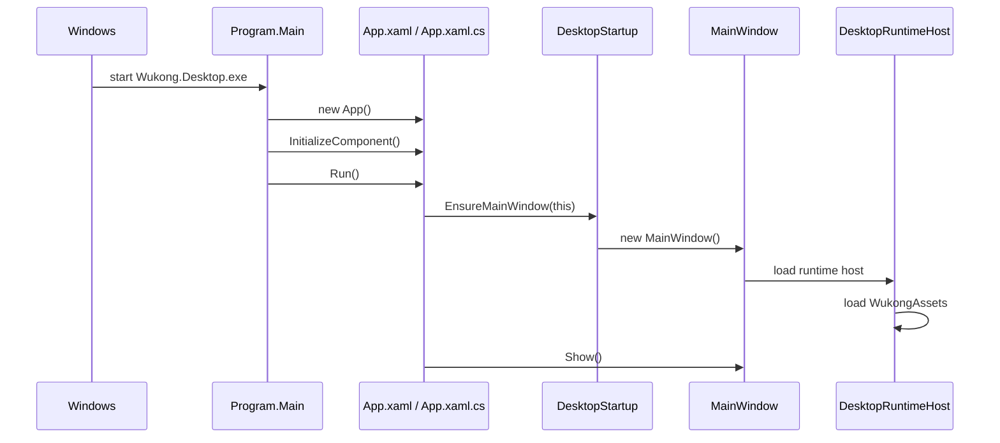
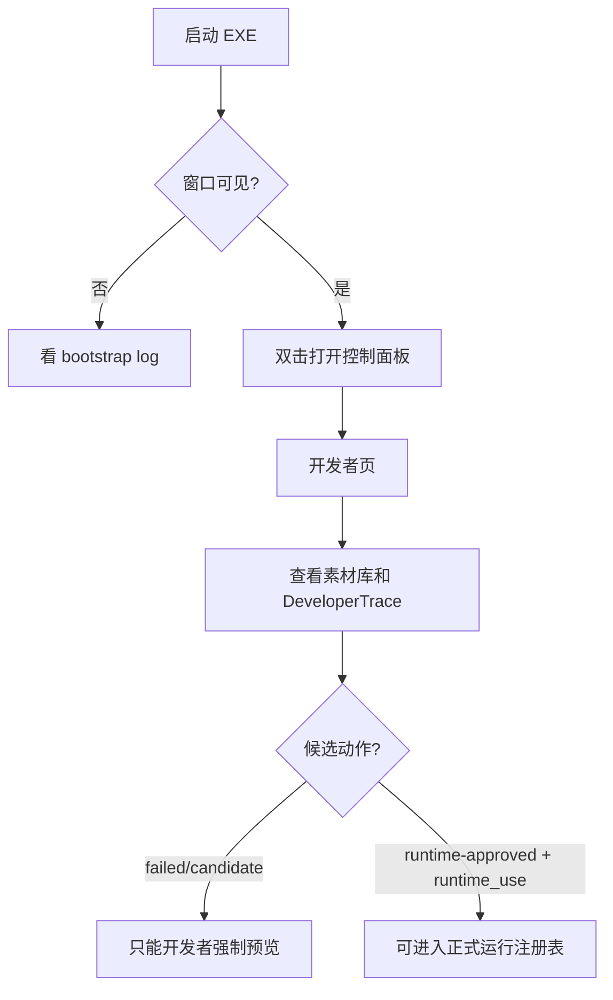

# 01 Quick Start

## 环境要求

| 项 | 要求 |
|---|---|
| OS | Windows 10/11，用于真实 WPF 透明窗口验证 |
| SDK | .NET 8 SDK |
| UI | WPF，项目入口为 `src/Wukong.Desktop` |
| Python | 用于 `tools/validate_contracts.py` 和 `tests/` 下的素材/契约测试 |

## 常用命令

```powershell
dotnet --list-sdks
dotnet --version
dotnet build Wukong.sln --no-restore -v minimal
dotnet run --project src\Wukong.Desktop\Wukong.Desktop.csproj --no-build
```

发布便携目录：

```powershell
dotnet publish src\Wukong.Desktop\Wukong.Desktop.csproj `
  -c Release `
  --self-contained false `
  -o .publish-check\runtime-assets-integration-20260812 `
  -v minimal
```

发布后的 EXE 示例：

```text
.publish-check/runtime-assets-integration-20260812/Wukong.Desktop.exe
```

## 启动链路



## 日志位置

Bootstrap 诊断日志：

```text
%LOCALAPPDATA%\Wukong\logs\bootstrap\yyyyMMdd.log
```

运行日志：

```text
%LOCALAPPDATA%\Wukong\logs\<runtime-mode>\yyyyMMdd.log
```

日志约束：

- 默认脱敏。
- 保留 30 天。
- 总量上限 50MB。
- 写入或清理失败不能阻塞桌宠主流程。

## 第一次运行时看什么



