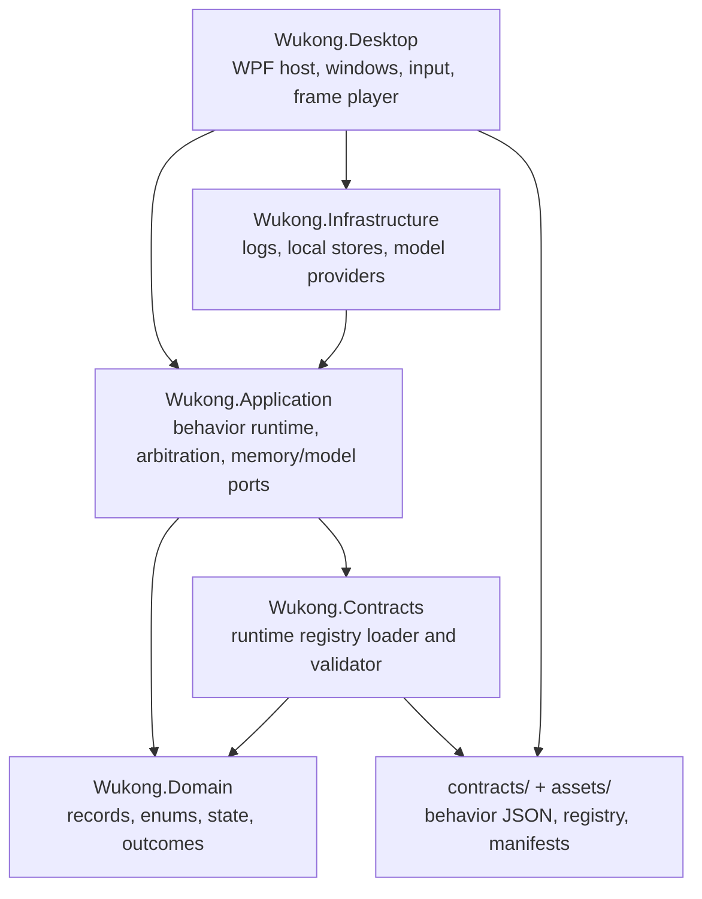
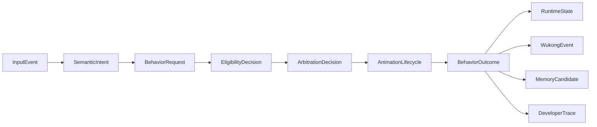
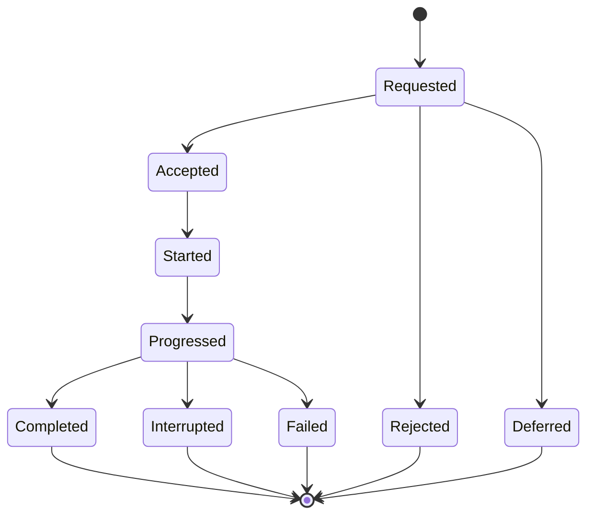
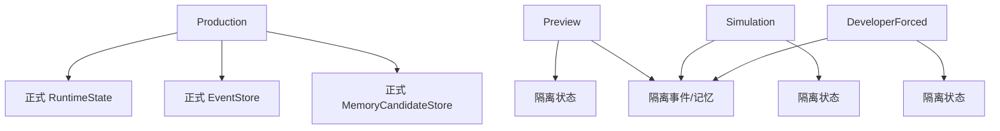

# 02 Architecture

## 分层原则

Wukong Desktop 的代码按“规则、契约、运行、平台接入”拆分，而不是按页面或按钮拆分。

## 模块职责

| 模块 | 主要文件 | 职责 | 不应该做 |
|---|---|---|---|
| `Wukong.Domain` | `BehaviorContracts.cs` | 定义 InputEvent、BehaviorRequest、RuntimeState、Outcome、Trace 等领域类型 | 访问文件、WPF、网络 |
| `Wukong.Contracts` | `RuntimeRegistry.cs` | 加载和校验运行注册表 | 绕过 `runtime_approved` / `runtime_use` |
| `Wukong.Application` | `BehaviorRuntime.cs`, `AgentConversation.cs` | 行为请求链路、仲裁、动画生命周期编排、模型和记忆端口 | 直接依赖 WPF 控件 |
| `Wukong.Infrastructure` | `InfrastructureServices.cs`, `AgentLocalStores.cs`, `ChatModelProviders.cs` | 日志、脱敏、本地存储、模型 Provider 实现 | 直接播放动画 |
| `Wukong.Desktop` | `MainWindow.xaml.cs`, `DesktopPetRuntime.cs`, `ControlPanelWindow.xaml.cs` | WPF 窗口、输入适配、桌宠帧播放、控制面板 | 让 UI 或模型绕过行为链路 |

## 核心行为链路

关键类型在 `src/Wukong.Domain/BehaviorContracts.cs`：

- `InputEvent`
- `SemanticIntent`
- `BehaviorRequest`
- `EligibilityDecision`
- `ArbitrationDecision`
- `AnimationLifecycle`
- `BehaviorOutcome`
- `RuntimeState`
- `WukongEvent`
- `MemoryCandidate`
- `DeveloperTrace`
- `ModelResponse`

## 请求结果和执行结果

`RequestDisposition` 只表示请求是否可接受：

- `Accepted`
- `Rejected`
- `Deferred`

`ExecutionStatus` 表示行为执行生命周期：

- `Started`
- `Progressed`
- `Completed`
- `Interrupted`
- `Failed`

## 生产与隔离模式

Preview、simulation、developer forced 不得写正式状态或正式记忆。

