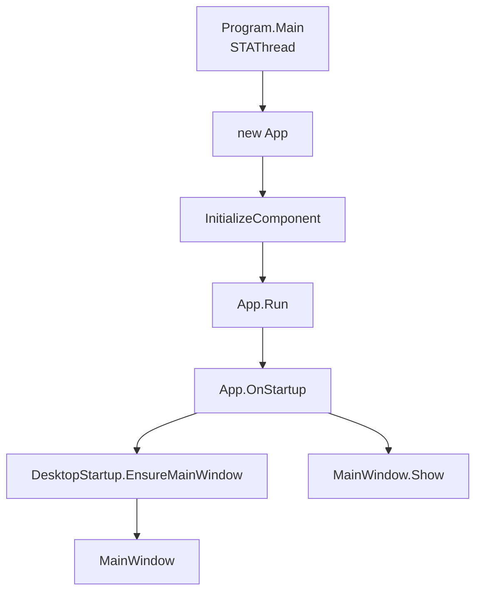
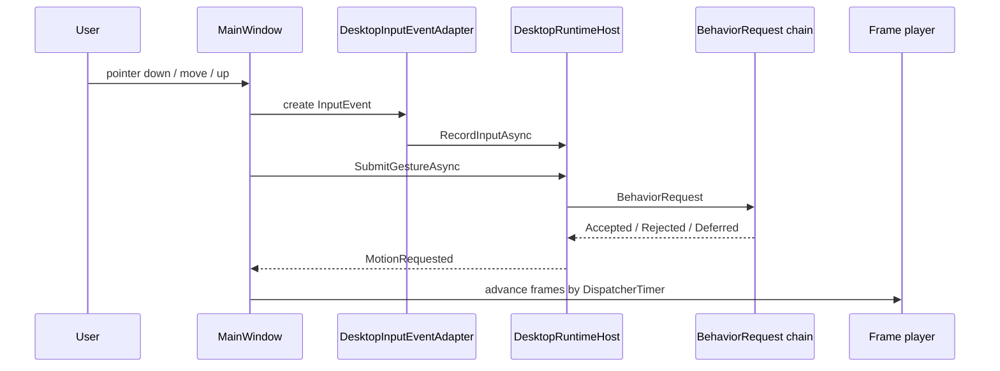
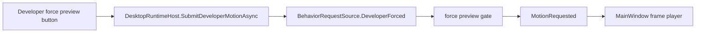

# 03 Desktop UI

## WPF 项目入口

`src/Wukong.Desktop/Wukong.Desktop.csproj` 的关键配置：

```xml
<OutputType>WinExe</OutputType>
<TargetFramework>net8.0-windows</TargetFramework>
<UseWPF>true</UseWPF>
<StartupObject>Wukong.Desktop.Program</StartupObject>
```

入口是显式的 `Program.Main`，然后初始化 `App`，再由 `App.OnStartup` 创建并显示唯一 `MainWindow`。



## 主窗口职责

`MainWindow.xaml.cs` 负责：

- 创建 `DesktopRuntimeHost`。
- 加载初始 idle motion。
- 启动自主 Tick 定时器。
- 用 `DispatcherTimer` 推进帧动画。
- 把鼠标输入转换为领域输入。
- 打开控制面板、聊天窗、右键菜单。
- 在窗口关闭时释放关联窗口和运行时资源。

## 输入事件链路



## 手势解释

`GestureInterpreter` 当前区分：

| 手势 | 判定方向 | 行为入口 |
|---|---|---|
| 单次轻触 | 真实可见区域命中，短时小移动 | owner touch |
| 抚摸 | 短时间中等距离移动 | stroke |
| 拖拽 | 按住并明显移动 | DragMove |
| 快速连续点击 | 900ms 内多次点击 | rapid tap |
| 双击 | 打开控制面板前也会记录 owner touch |
| 右键 | WPF context menu | context menu BehaviorRequest |

透明区域不能误触；拖动窗口不能同时触发 touch。

## 控制面板

控制面板来自 `ControlPanelWindow.xaml` 和 `ControlPanelWindow.xaml.cs`。UX 契约来自 `docs/ux/wukong-ux.html`。

当前控制面板包含：

- 主人
- 档案
- 相册
- 大模型
- 素材
- 开发者

开发者页可查看候选口令动作，并通过开发者强制预览路径播放候选素材。这个路径仍然进入运行时请求链，不是按钮直接调播放器。



## 桌宠帧播放器

WPF 侧的帧播放器在 `MainWindow.xaml.cs` 中：

- `Runtime_MotionRequested` 接收 `PetMotionRequest`。
- `_animationTimer` 按 `FrameDurationMs` 推进。
- `AdvanceFrame` 处理 phase、loop、完成回落。
- `SetFrame` 解码 PNG 并更新 Image。
- 缺失或解码失败时显示 fallback。

这是一层桌面播放宿主，不是生产行为仲裁器。

