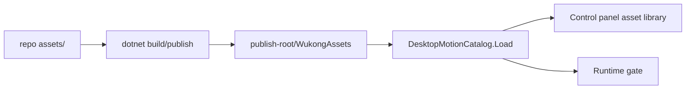
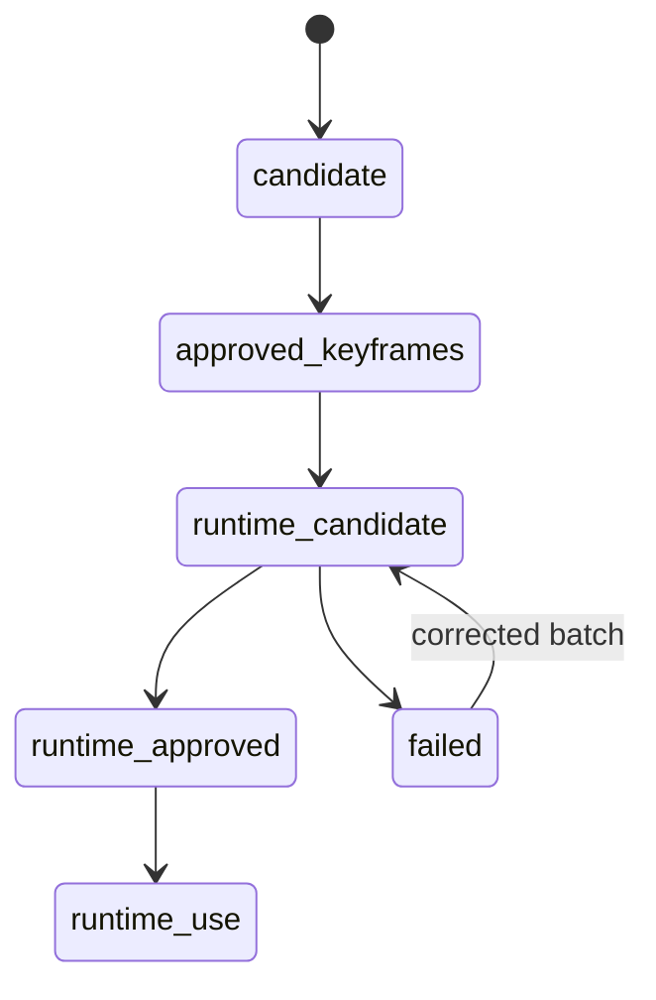
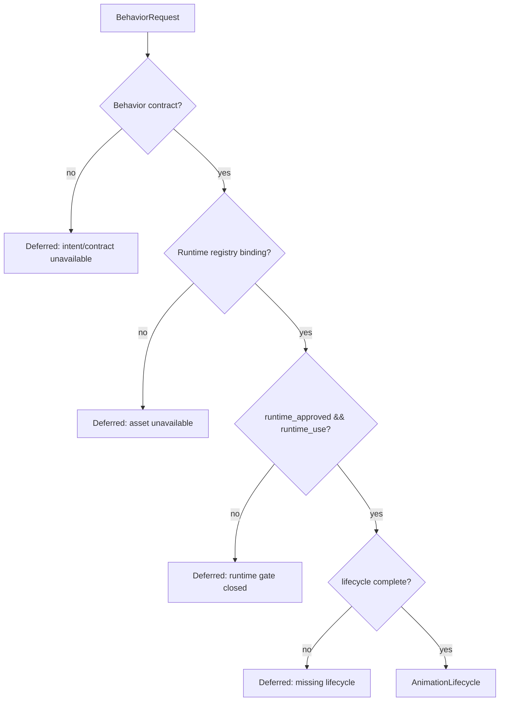

# 04 Assets Runtime

## 素材目录

核心目录：

```text
assets/
  identity/
  actions/
  action-batches/
```

发布时，`Wukong.Desktop.csproj` 会把素材复制为：

```text
<publish-root>/WukongAssets/
```

复制类型：

- `*.png`
- `*.json`
- `*.gif`



## 素材生命周期



含义：

| 状态 | 含义 | 能否生产运行 |
|---|---|---|
| `candidate` | 待审素材 | 否 |
| `approved-keyframes` | 关键帧视觉认可 | 否 |
| `runtime-candidate` | 有完整序列，等待真实播放器 QA | 否 |
| `runtime-approved` | 通过真实桌面 renderer QA | 只有 `runtime_use=true` 时可以 |
| `failed` | 验收失败，保留证据等待返工 | 否 |

## Runtime gate

生产运行必须同时满足：

- 行为契约存在。
- 素材 manifest/registry 绑定存在。
- `runtime_approved=true`。
- `runtime_use=true`。
- 生命周期素材完整。
- 没有违反 source policy。



## 当前口令动作候选批次

目录：

```text
assets/action-batches/WK-COMMAND-ACTION-CANDIDATES-v3/
```

动作：

| 行为 ID | 目录 | 帧数 | 当前门禁 |
|---|---|---:|---|
| `wk.command.paw_rise` | `01_sit_prone_paw_rise` | 8 | failed / not approved / not runtime_use |
| `wk.command.jump` | `02_jump` | 8 | failed / not approved / not runtime_use |
| `wk.command.spin_approach_stop_sit` | `03_spin_approach_stop_sit` | 10 | failed / not approved / not runtime_use |
| `wk.command.paw_eat` | `04_sit_prone_paw_eat` | 9 | failed / not approved / not runtime_use |

人工透明窗口验收失败原因：

- `color_inconsistency`
- `geometry_scale_jitter`
- `uneven_timing`

这批素材可以在开发者页强制预览，但不能开放正式口令，不能进入自主行为池。

## 额外预览 PNG

该批次有 42 张 PNG，其中 35 张是动作帧，7 张是预览/参考图：

- `previews/01_sit_prone_paw_rise-contact-sheet.png`
- `previews/02_jump-contact-sheet.png`
- `previews/03_spin_approach_stop_sit-contact-sheet.png`
- `previews/04_sit_prone_paw_eat-contact-sheet.png`
- `previews/all-groups-overview.png`
- `previews/shared-prone-proof.png`
- `previews/shared-sit-proof.png`

它们不在 action `frames[]` 中，不会被注册为 playable frame。

