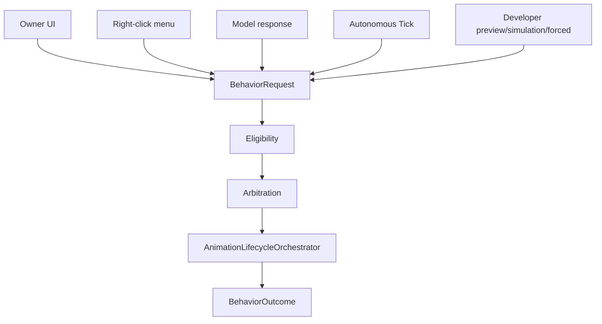
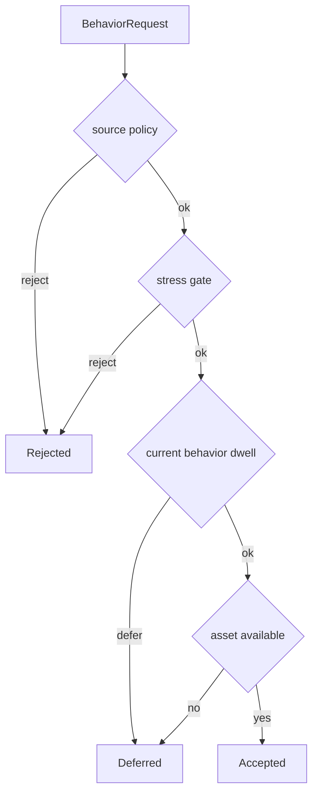
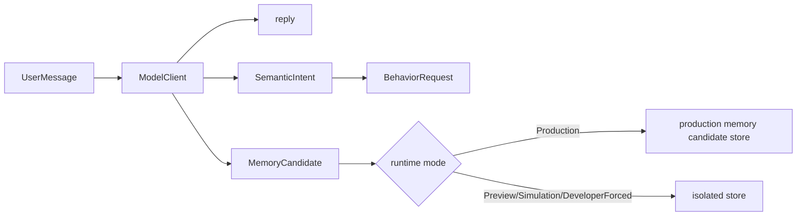

# 05 Behavior, Model, Memory

## 所有入口统一成 BehaviorRequest

约束：

- UI 不能直接调用动画播放器。
- 右键菜单不能直接调用动画播放器。
- 模型不能直接指定素材路径。
- 自主 Tick 不能绕过资格判断和仲裁。
- Developer forced 只能在隔离模式或明确 force preview 边界下使用。

## Eligibility

`BehaviorRequestService` 会检查：

- source policy
- stress gate
- 当前行为是否可中断
- minimum dwell
- pose eligibility
- cooldown
- runtime asset availability

## Arbitration

当前确定性仲裁基于：

- behavior id
- runtime state
- request clock
- seed
- score components

DeveloperTrace 必须记录 score components 和 Rejected/Deferred 原因。

## Model boundary

模型端口在 `Wukong.Application`，Provider 实现在 `Wukong.Infrastructure`。

模型允许返回：

- reply
- `SemanticIntent`
- `MemoryCandidate`

模型禁止：

- 命名素材文件。
- 直接写 RuntimeState。
- 直接写正式记忆。
- 强制行为执行。
- 绕过 eligibility / arbitration / runtime gate。

## Memory boundary

第一期只记录事件和 MemoryCandidate，不实现长期性格学习。Preview、simulation、developer forced 不写正式状态或正式记忆。

| 模式 | RuntimeState | EventStore | MemoryCandidateStore |
|---|---|---|---|
| Production | 正式 | 正式 | 正式 |
| Preview | 隔离 | 隔离 | 隔离 |
| Simulation | 隔离 | 隔离 | 隔离 |
| DeveloperForced | 隔离/预览边界 | 隔离 | 隔离 |

## 日志和 DeveloperTrace

日志通过 `RollingFileLogStore`：

- 默认脱敏。
- 按 runtime mode 分目录。
- 30 天保留。
- 50MB 总量上限。
- 清理失败不阻塞。

`DeveloperTrace` 面向开发者诊断，不是生产控制入口，不能绕过脱敏或 runtime gate。

