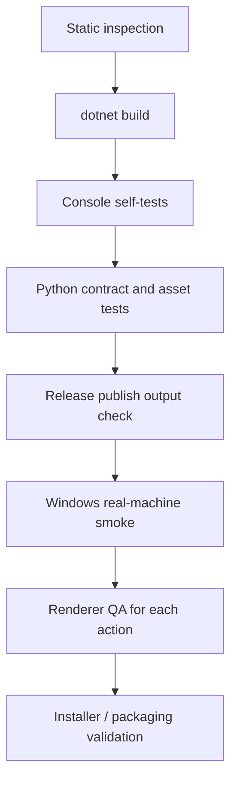
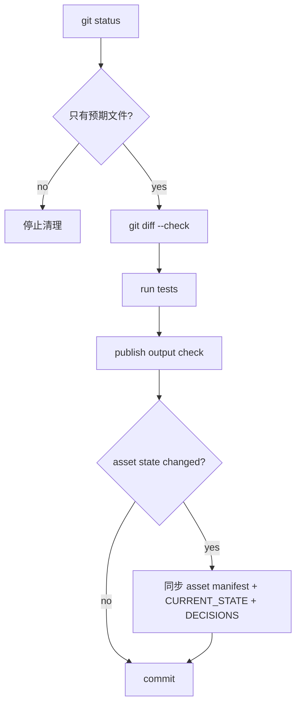

# 06 Testing and Release

## 验证层级



不要混淆这些层级。自动测试通过不等于 Windows 真实透明窗口验收通过。

## 常用验证命令

```powershell
dotnet build Wukong.sln --no-restore -v minimal

dotnet run --project tests\Wukong.Domain.Tests\Wukong.Domain.Tests.csproj --no-build
dotnet run --project tests\Wukong.Contracts.Tests\Wukong.Contracts.Tests.csproj --no-build
dotnet run --project tests\Wukong.Application.Tests\Wukong.Application.Tests.csproj --no-build
dotnet run --project tests\Wukong.Infrastructure.Tests\Wukong.Infrastructure.Tests.csproj --no-build
dotnet run --project tests\Wukong.Desktop.Tests\Wukong.Desktop.Tests.csproj --no-build

python tools\validate_contracts.py
python -m unittest discover -s tests -v
git diff --check
```

## Release publish 检查

```powershell
dotnet publish src\Wukong.Desktop\Wukong.Desktop.csproj `
  -c Release `
  --self-contained false `
  -o .publish-check\runtime-assets-integration-20260812 `
  -v minimal
```

发布目录必须包含：

- `Wukong.Desktop.exe`
- 应用 DLL
- `WukongAssets/`
- 需要运行或开发者预览的 PNG/JSON/GIF 素材

发布目录不得包含：

- `tests/`
- `tests/Fixtures/`
- `reference/pupu-source/`
- `__pycache__/`
- 本地日志
- 密钥、Token、用户绝对路径
- `.git/`

## Windows 实机验证清单

| 项 | 状态记录方式 |
|---|---|
| EXE 双击或 Start-Process 后 5 秒内仍存活 | PASS / FAIL |
| 透明窗口肉眼可见 | PASS / FAIL |
| HWND 非 0 | PASS / FAIL |
| SourceInitialized / Loaded / ContentRendered 到达 | PASS / FAIL |
| 鼠标点击、拖拽、右键菜单正常 | PASS / FAIL |
| 双击打开控制面板 | PASS / FAIL |
| 自主 Tick 不绕过 gate | PASS / FAIL |
| 未 approved 素材不进生产池 | PASS / FAIL |
| 日志脱敏 | PASS / FAIL |
| 关闭后无残留进程 | PASS / FAIL |

## Renderer QA

每个动作单独记录：

- 帧间毛色是否一致。
- 主体大小和轮廓是否稳定。
- 透明边缘是否正常。
- 动作节奏是否均匀。
- 起始姿态和结束姿态是否符合 contract。
- interrupt_exit 和 fallback 是否安全。

当前 `WK-COMMAND-ACTION-CANDIDATES-v3` 四组动作均未通过 renderer QA，不可批准。

## 提交前检查



不要提交：

- `bin/`
- `obj/`
- `.publish-check/`
- `.dotnet-cli-home/`
- `__pycache__/`
- 本地日志
- `reference/pupu-source/`

