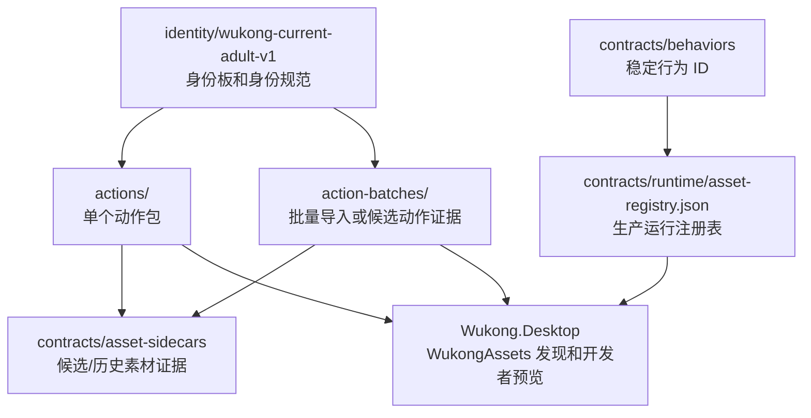
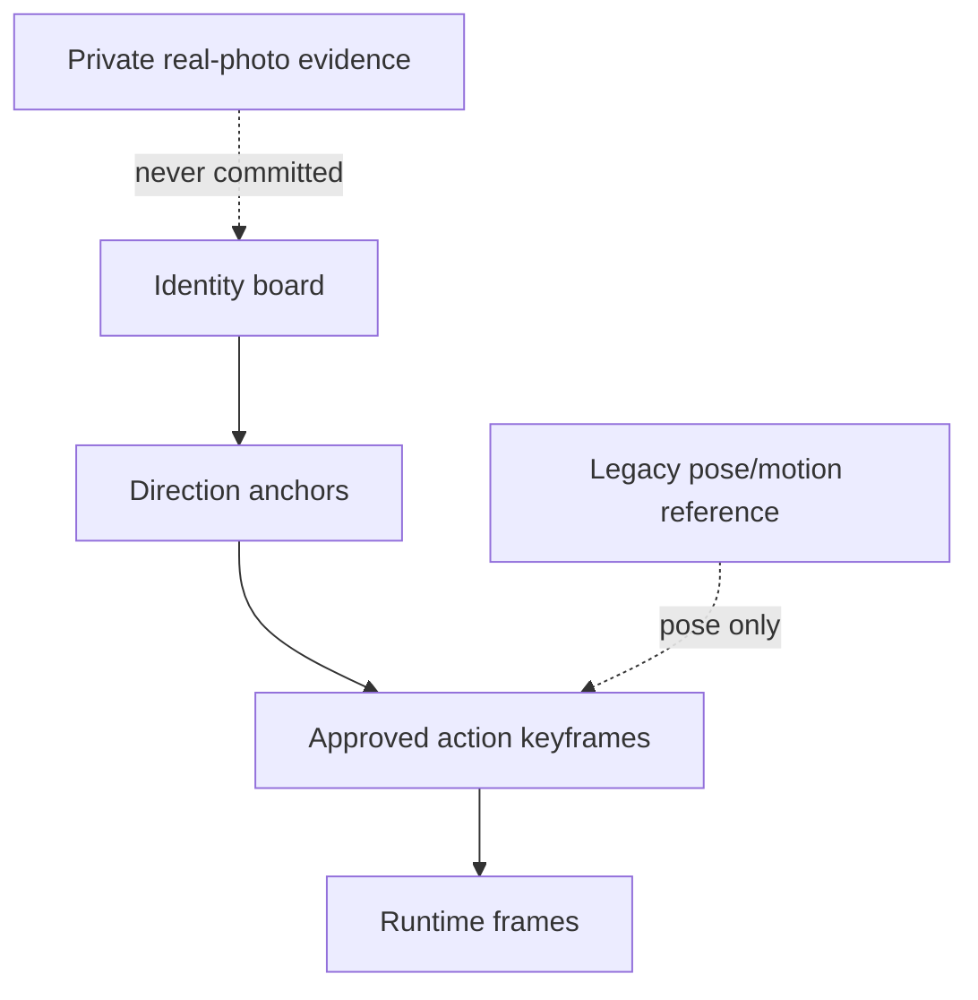
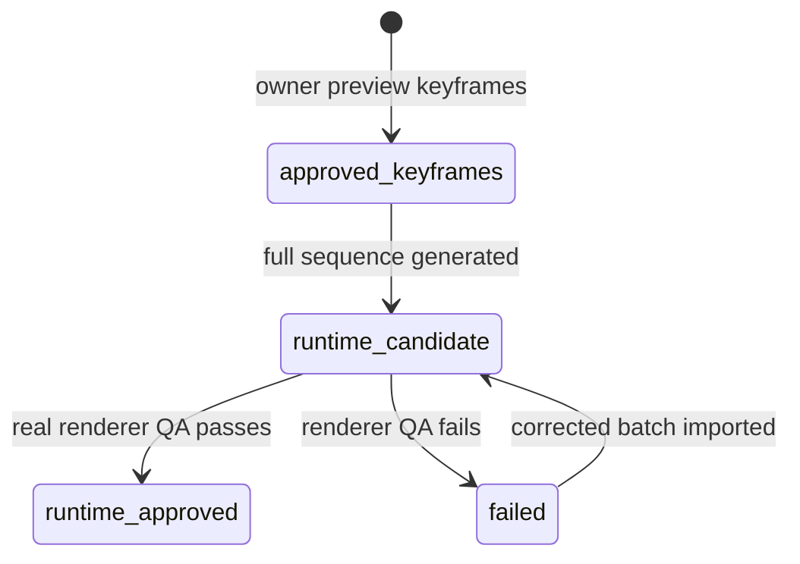
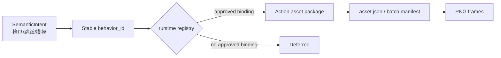
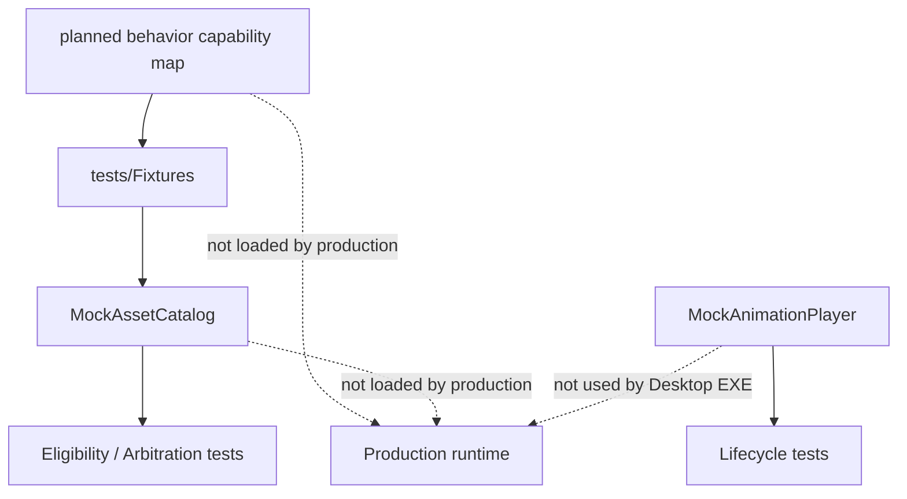
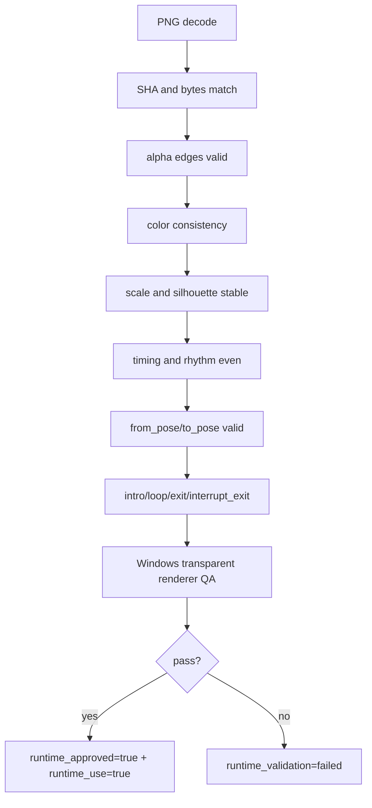

# 08 Current Asset Design

这篇说明当前 Wukong 素材的设计方式、目录状态和后续补素材时应该遵守的边界。它基于当前仓库事实，不把候选素材误写成已批准运行素材。

## 当前素材总览



当前生产运行注册表仍为空：

```text
contracts/runtime/asset-registry.json
```

含义是：没有任何动作同时满足 `runtime_approved=true` 和 `runtime_use=true`。桌面端可以显示或开发者预览部分素材，但这不等价于生产行为已开放。

## 身份设计

当前身份包：

```text
assets/identity/wukong-current-adult-v1/
  identity-board.png
  identity-spec.md
  manifest.json
  README.md
```

身份层级遵守 `ASSET_STRUCTURE.md`：

1. 已批准 identity board 和最近方向锚点。
2. 私有真实照片证据，不进入公开仓库。
3. 当前动作的已批准关键帧。
4. 旧素材只作姿态和运动参考。
5. 文本说明。



核心原则：

- 不提交 Wukong 真实照片。
- 不用 Pupu 或其他宠物素材替代身份。
- 不独立重绘整只狗来修一个局部问题。
- 修毛色、比例、边缘、姿态时，只改被点名的问题，保留无关属性。

## 动作素材目录

当前 `assets/actions/` 下有这些动作包：

| Action package | 当前用途 |
|---|---|
| `WK-CORE-PRONE-IDLE-LF-v1` | 趴卧/待机相关素材，包含 approved keyframes 和 runtime candidate 证据 |
| `WK-CORE-PRONE-TO-STAND-LF-v2` | 趴到站姿候选/关键帧证据 |
| `WK-CORE-SIT-TO-STAND-LF-v1` | 坐到站姿证据 |
| `WK-CORE-SLEEP-BREATH-v2` | 侧躺/睡眠呼吸证据 |
| `WK-CORE-STAND-IDLE-LF-v1` | 站立待机证据 |
| `WK-CORE-STAND-TO-PRONE-LF-v2` | 站到趴姿证据 |
| `WK-CORE-STAND-TO-SIT-LF-v1` | 站到坐姿证据 |
| `WK-CORE-TURN-LF-TO-RF-v2` | 转向证据 |
| `WK-CORE-WALK-LEFT-TRANSITIONS-v1` | 行走起止过渡证据 |
| `WK-CORE-WALK-LEFT-v2` | 左行走证据 |
| `WK-INTERACT-HAPPY-TOUCH-v2` | 触摸互动候选证据 |

每个 action package 应优先以自己的 `asset.json` 记录：

- 阶段状态。
- 来源和审批记录。
- 帧路径。
- 尺寸。
- SHA-256。
- runtime validation。
- `runtime_approved`。
- `runtime_use`。

## 批次素材目录

当前 `assets/action-batches/` 下有四个批次：

| Batch | 状态 |
|---|---|
| `WK-BASIC-ACTIONS-BATCH-v2` | 17 张 owner-preview approved keyframes，只是关键帧批准，不是 runtime-approved |
| `WK-P0-GENERATED-ACTIONS-2026-08-06` | P0 生成动作候选和部分批准关键姿态，仍需 renderer QA |
| `WK-INTERACTION-PRONE-TOUCH-v4-1` | 70 帧 touch runtime candidate，owner preview approved，但 `runtime_use=false` |
| `WK-COMMAND-ACTION-CANDIDATES-v3` | 4 组口令动作候选，人工透明窗口验收失败 |



## 当前口令动作候选设计

目录：

```text
assets/action-batches/WK-COMMAND-ACTION-CANDIDATES-v3/
```

四组动作：

| Behavior ID | Source folder | Frames | Current state |
|---|---|---:|---|
| `wk.command.paw_rise` | `01_sit_prone_paw_rise` | 8 | failed |
| `wk.command.jump` | `02_jump` | 8 | failed |
| `wk.command.spin_approach_stop_sit` | `03_spin_approach_stop_sit` | 10 | failed |
| `wk.command.paw_eat` | `04_sit_prone_paw_eat` | 9 | failed |

失败原因：

- `color_inconsistency`
- `geometry_scale_jitter`
- `uneven_timing`

这些动作的设计价值在于：

- 已经有稳定 behavior ID。
- 已经有 manifest、帧顺序、FPS、时长、姿态、SHA-256。
- 已经能在开发者模式强制预览。
- 已经能证明 runtime gate 可以阻止未批准素材进入生产路径。

它们不能：

- 标记 `runtime_approved=true`。
- 标记 `runtime_use=true`。
- 进入 `contracts/runtime/asset-registry.json`。
- 进入自主行为池。
- 被正式口令直接执行。

## 素材和行为 ID 的关系

行为 ID 是稳定语义，素材 ID 是具体实现版本。



这意味着后续可以替换素材版本，而不改行为语义。例如 `wk.command.jump` 可以先绑定 v3 失败候选，返工后再绑定 v4 通过版；行为 ID 不应该跟随文件夹名频繁变化。

## Mock 素材策略

在真实素材不完善时，可以 mock 这些东西：

- Asset availability。
- AnimationLifecycle。
- PlaybackOutcome。
- 帧推进结果。
- 播放器失败、完成、中断。
- 行为结束后的 StateDelta。

不应该 mock 这些东西：

- `runtime_approved=true`。
- `runtime_use=true`。
- 生产 registry 绑定。
- 真实 Windows renderer QA 通过。
- 真实素材 PNG。

推荐边界：



建议目录：

```text
docs/behavior/behavior-capability-map.md
tests/Fixtures/mock-asset-catalog.json
tests/Fixtures/mock-animation-lifecycle.json
```

生产代码不应读取这些 fixture。

## 未来补素材的建议

优先补“行为闭环”所需的最少动作，而不是一次性追求大量动作。

### P0 最小素材闭环

| 能力 | 素材要求 |
|---|---|
| 安静趴卧 | loop 稳定、毛色一致、边缘透明、呼吸节奏自然 |
| touch 反应 | intro / loop / exit / interrupt_exit |
| 停下 | 任意动作可安全回落到 idle |
| 回头观察 | 起止姿态稳定，不能主体跳变 |
| 睡眠/侧躺 | 需要安全 enter/exit，不只是循环帧 |

### 每组动作验收清单



## 设计底线

- 素材不完善时，先完善 Agent 和行为决策，用 mock catalog 测逻辑。
- 不用假素材污染生产 registry。
- 不把 GitHub GIF、自动测试或预览通过当成 renderer QA。
- 不把关键帧扩成伪 runtime-approved 动画。
- 不复制 Pupu 素材、动作映射或行为 ID。
- 每次素材状态变化都同步 manifest、`CURRENT_STATE.md` 和 `DECISIONS.md`。

