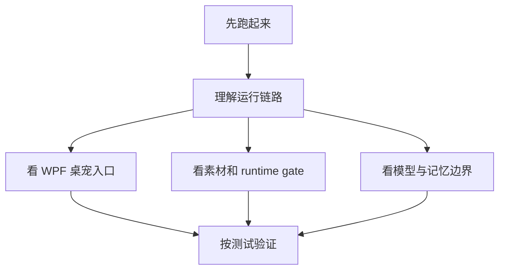
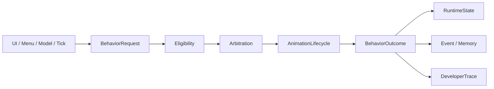
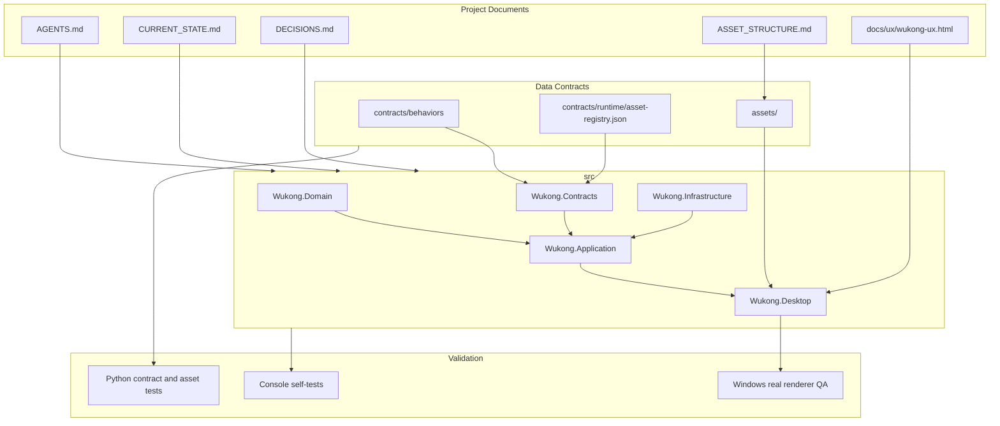

# Wukong Desktop README Hub

这个目录是一组面向读代码和交接的 README。它不替代根目录的 `AGENTS.md`、`CURRENT_STATE.md`、`DECISIONS.md` 和素材 manifest；这些文件仍然是项目事实和约束的源头。

## 阅读路径

| 文档 | 适合谁 | 解决什么问题 |
|---|---|---|
| [01 Quick Start](01-quick-start.md) | 第一次运行项目的人 | 环境、构建、启动、发布输出在哪里 |
| [02 Architecture](02-architecture.md) | 需要读整体代码的人 | Domain / Contracts / Application / Infrastructure / Desktop 如何分工 |
| [03 Desktop UI](03-desktop-ui.md) | 改 WPF 和交互的人 | 入口、透明窗口、控制面板、输入事件如何接入 |
| [04 Assets Runtime](04-assets-runtime.md) | 改素材和动作的人 | `WukongAssets`、manifest、runtime gate、候选素材状态 |
| [05 Behavior Model Memory](05-behavior-model-memory.md) | 改行为、模型、记忆的人 | BehaviorRequest 链路、模型边界、隔离状态 |
| [06 Testing Release](06-testing-release.md) | 准备验收或发版的人 | 自动测试、Python 校验、Release publish、Windows 实机边界 |
| [07 Agent And Memory](07-agent-and-memory.md) | 改控制面板、档案、模型上下文的人 | 宠物设定、档案、记忆开关、相册记忆、对话候选记忆如何工作 |
| [08 Current Asset Design](08-current-asset-design.md) | 规划和返工素材的人 | 当前素材结构、设计原则、动作批次状态、mock 素材边界 |

## 项目一句话

Wukong Desktop 是一个 Windows 桌面宠物项目，当前技术栈是 .NET 8 + WPF。它的核心不是“按钮直接播放动画”，而是把 UI、右键菜单、自主 Tick、模型建议和开发者调试都统一转换为 `BehaviorRequest`，再经过资格判断、仲裁、动画生命周期、状态更新、事件/记忆记录和 DeveloperTrace。

## 当前必须记住的边界

- `main` 受保护，不能擅自修改、合并或推送。
- `reference/pupu-source/` 是只读参考，不能复制 Pupu 的素材、行为 ID、状态数据、动作映射或隐私数据。
- 只有 Wukong 素材能进入 Wukong 运行体系。
- `approved-keyframes` 不等于 `runtime-approved`。
- `runtime_approved=false` 或 `runtime_use=false` 的素材不能进入生产运行注册表。
- Preview、simulation、developer forced 必须使用隔离状态和隔离事件/记忆存储。
- Windows 真机可见、renderer QA、安装器验证必须和本机构建/自动测试分开表述。

## 代码阅读总图

